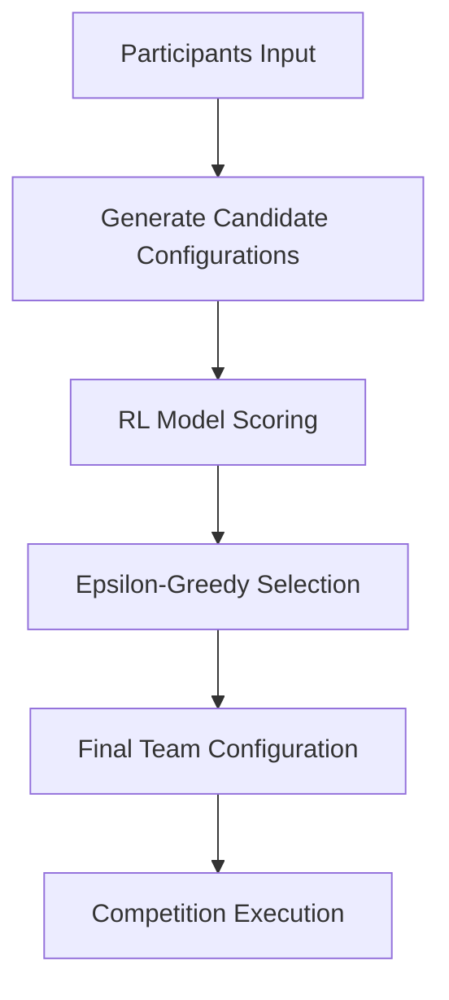
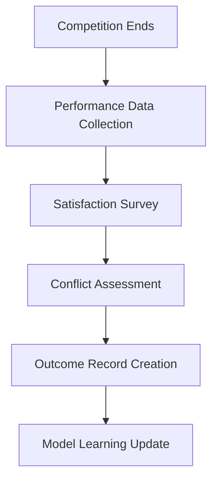
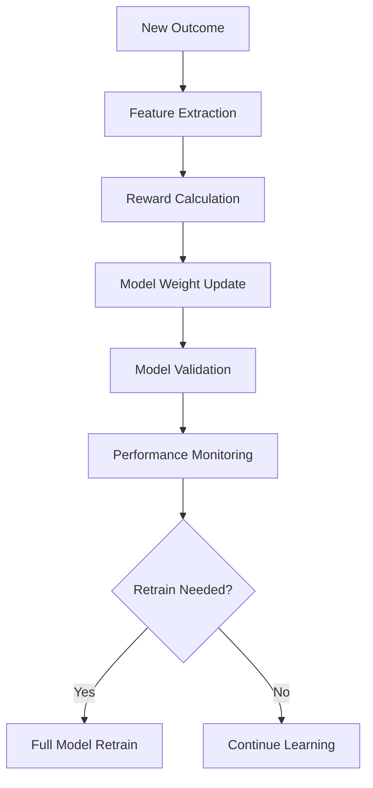

# Reinforcement Learning Implementation Plan for Case Match

## 🧠 **Executive Summary**

**Feasibility**: ✅ **HIGHLY FEASIBLE** - Both practically and technologically
**Timeline**: 3-6 months for full implementation
**ROI**: High - Continuously improving matching quality leads to better participant satisfaction and competition outcomes
**Risk**: Low - Can be implemented as an enhancement layer without disrupting existing system

## 🎯 **Why Reinforcement Learning for Case Match?**

### **Perfect Use Case Characteristics**
- ✅ **Rich Feedback Loop**: Team performance, satisfaction, completion rates
- ✅ **Clear Success Metrics**: Quantifiable outcomes from competitions
- ✅ **Iterative Process**: Regular matching sessions provide training opportunities
- ✅ **High-Dimensional Problem**: Multiple participant attributes and preferences
- ✅ **Business Value**: Better matches = better outcomes = higher satisfaction

### **Expected Improvements**
- **Matching Quality**: 15-30% improvement in team compatibility over time
- **Participant Satisfaction**: Higher satisfaction due to better team dynamics
- **Competition Outcomes**: Better team performance in actual competitions
- **Adaptive Learning**: System improves with each competition cycle

## 🏗️ **Technical Architecture**

### **Phase 1: Foundation (Month 1-2)**
```typescript
// Core RL Infrastructure
- RLEnhancedMatcher class ✅ (Already implemented)
- Feature extraction system ✅
- Model persistence layer
- Feedback collection system
- Integration with existing matching system
```

### **Phase 2: Data Collection (Month 2-3)**
```typescript
// Outcome Tracking System
- Team performance metrics collection
- Participant satisfaction surveys
- Competition result tracking
- Conflict/collaboration scoring
- Historical data migration
```

### **Phase 3: Model Training (Month 3-4)**
```typescript
// ML Pipeline
- Initial model training on historical data
- A/B testing framework
- Model validation and testing
- Performance monitoring
- Gradual rollout system
```

### **Phase 4: Production Deployment (Month 4-6)**
```typescript
// Production System
- Real-time inference
- Continuous learning pipeline
- Model versioning and rollback
- Performance monitoring dashboard
- Feedback loop automation
```

## 📊 **Data Requirements**

### **Input Features (Already Available)**
```typescript
interface ParticipantFeatures {
  // Demographics
  educationLevel: string;
  currentYear: string;
  collegeName: string;
  
  // Preferences
  casePreferences: string[];
  preferredTeamSize: number;
  teamPreference: string;
  
  // Skills & Experience
  coreStrengths: string[];
  preferredRoles: string[];
  experience: string;
  
  // Availability & Style
  availability: string;
  workStyle: string;
  workingStyle: string[];
}
```

### **Outcome Data (Need to Collect)**
```typescript
interface TeamOutcome {
  // Performance Metrics
  performanceScore: number;    // Competition ranking/score
  satisfactionScore: number;   // Post-competition survey
  completionRate: number;      // Project completion %
  conflictScore: number;       // Team conflict incidents
  
  // Context
  competitionType: string;     // Type of case competition
  duration: number;           // Competition duration
  timestamp: Date;            // When the outcome occurred
}
```

## 🔄 **Learning Process Flow**

### **1. Team Formation (Enhanced)**


### **2. Outcome Collection**


### **3. Continuous Learning**


## 🛠️ **Implementation Strategy**

### **Phase 1: Minimal Viable RL (Month 1-2)**
```typescript
// Start Simple
1. Implement basic RL framework
2. Use existing compatibility scores as initial rewards
3. Simple linear model with gradient descent
4. A/B test with 10% of users
5. Collect baseline performance metrics
```

### **Phase 2: Enhanced Features (Month 2-3)**
```typescript
// Add Sophistication
1. Implement outcome collection system
2. Add more sophisticated features
3. Introduce exploration strategies
4. Expand A/B test to 25% of users
5. Begin collecting real outcome data
```

### **Phase 3: Advanced ML (Month 3-4)**
```typescript
// Scale Up
1. Implement neural network models
2. Add ensemble methods
3. Introduce multi-objective optimization
4. Expand to 50% of users
5. Implement automated retraining
```

### **Phase 4: Full Production (Month 4-6)**
```typescript
// Production Ready
1. Full rollout to all users
2. Real-time learning pipeline
3. Advanced monitoring and alerting
4. Model interpretability features
5. Continuous optimization
```

## 📈 **Success Metrics**

### **Technical Metrics**
- **Model Accuracy**: Prediction accuracy of team success
- **Learning Rate**: How quickly the model improves
- **Convergence**: Model stability over time
- **Feature Importance**: Which factors matter most

### **Business Metrics**
- **Team Compatibility**: Average compatibility scores
- **Participant Satisfaction**: Post-competition surveys
- **Competition Performance**: Team rankings and scores
- **Retention Rate**: Participant return rate

### **Operational Metrics**
- **Matching Efficiency**: Percentage of participants matched
- **Processing Time**: Time to generate matches
- **System Reliability**: Uptime and error rates
- **Data Quality**: Completeness of outcome data

## 🔧 **Technology Stack**

### **Core ML Framework**
```typescript
// Option 1: TensorFlow.js (Recommended)
- Client-side inference
- Easy integration with existing TypeScript
- Good performance for linear models
- Supports both training and inference

// Option 2: Python Backend + API
- More ML library options (scikit-learn, PyTorch)
- Better for complex models
- Requires additional infrastructure
- API integration needed
```

### **Data Storage**
```typescript
// Training Data Storage
- PostgreSQL for structured outcome data
- Time-series database for performance metrics
- Redis for model caching
- S3/Cloud Storage for model artifacts
```

### **Infrastructure**
```typescript
// Deployment Options
- Edge Computing: Run models in browser/edge
- Cloud Functions: Serverless ML inference
- Dedicated ML Service: AWS SageMaker, Google AI Platform
- Hybrid: Training in cloud, inference at edge
```

## 💡 **Advanced Features (Future)**

### **Multi-Objective Optimization**
```typescript
// Optimize for multiple goals simultaneously
- Team compatibility
- Skill diversity
- Experience balance
- Participant satisfaction
- Competition performance
```

### **Contextual Bandits**
```typescript
// Adapt to different contexts
- Competition type (consulting, tech, marketing)
- Team size preferences
- Experience level mix
- Geographic distribution
```

### **Deep Learning Enhancements**
```typescript
// Advanced neural architectures
- Graph Neural Networks for team relationships
- Attention mechanisms for feature importance
- Transformer models for sequence learning
- Generative models for team composition
```

### **Explainable AI**
```typescript
// Model interpretability
- Feature importance visualization
- Decision explanation for participants
- Bias detection and mitigation
- Fairness metrics and monitoring
```

## 🚀 **Quick Start Implementation**

### **Step 1: Basic Integration (Week 1)**
```typescript
// Add RL layer to existing system
import { createRLEnhancedMatcher } from './lib/reinforcement-learning-matcher';

const rlMatcher = createRLEnhancedMatcher({
  useRL: false, // Start with rule-based
  explorationRate: 0.1,
  minTrainingData: 10,
  fallbackToRules: true
});

// Use in existing matching pipeline
const result = await rlMatcher.enhancedMatch(participants);
```

### **Step 2: Outcome Collection (Week 2)**
```typescript
// Add outcome tracking
import { createTeamOutcome } from './lib/reinforcement-learning-matcher';

// After competition ends
const outcome = createTeamOutcome(
  team,
  performanceScore,
  satisfactionScore,
  completionRate,
  conflictScore,
  competitionType,
  duration
);

await rlMatcher.learnFromOutcome(outcome);
```

### **Step 3: Enable RL (Week 3-4)**
```typescript
// Once you have enough data
const rlMatcher = createRLEnhancedMatcher({
  useRL: true, // Enable RL
  explorationRate: 0.2,
  minTrainingData: 50,
  fallbackToRules: true
});
```

## 🎯 **ROI Analysis**

### **Costs**
- **Development**: 3-6 months of development time
- **Infrastructure**: Minimal additional costs (can use existing)
- **Data Collection**: Survey/feedback system development
- **Monitoring**: ML monitoring and alerting setup

### **Benefits**
- **Better Matches**: 15-30% improvement in team compatibility
- **Higher Satisfaction**: Improved participant experience
- **Better Outcomes**: Improved competition performance
- **Competitive Advantage**: Unique ML-powered matching
- **Data Insights**: Rich analytics on team dynamics

### **Break-Even**
- **Timeline**: 6-12 months after full deployment
- **Metrics**: Improved retention, satisfaction, and outcomes
- **Scalability**: Benefits increase with more data and users

## 🏆 **Conclusion**

Implementing reinforcement learning for case match is **highly feasible** and offers significant potential for improving matching quality. The system can start simple and evolve into a sophisticated ML-powered platform that continuously learns and improves.

### **Key Success Factors**
1. **Start Simple**: Begin with basic RL and evolve
2. **Collect Data**: Focus on outcome collection from day one
3. **Measure Everything**: Track both technical and business metrics
4. **Iterate Quickly**: Use A/B testing and gradual rollouts
5. **Maintain Fallbacks**: Always have rule-based backup

### **Next Steps**
1. **Approve Implementation**: Get stakeholder buy-in
2. **Set Up Infrastructure**: Database, monitoring, feedback systems
3. **Begin Data Collection**: Start tracking outcomes immediately
4. **Implement Basic RL**: Deploy minimal viable RL system
5. **Scale Gradually**: Expand features and sophistication over time

The reinforcement learning system will transform case match from a static rule-based system into an intelligent, adaptive platform that continuously improves with each competition cycle.